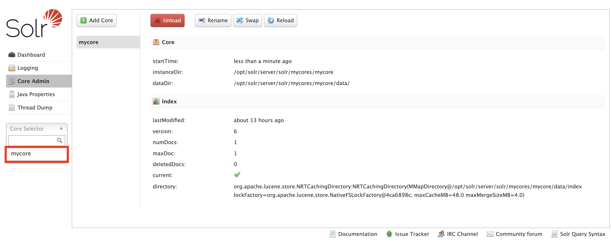

# Nutch/Solr docker landscape
Part of this repository is the Nutch + Solr landscape for docker. It is based on the repo of [basraven](https://github.com/basraven/nutch-solr-integration). For a working integration of the Solr API the jetty library was integrated. Apache Nutch is used to crawl websites. Apache Solr is used as Indexer and offers the services for our Searchr (custom developed React Search Engine Web App). See [Searchr Repo](https://github.com/fiveamdeveloper/Searchr) for more information.

## Nutch configuration
Nutch configuration files are inside `nutch` folder. Seed.txt file includes to be crawled url(s) (one line per URL, no separator is required). `regex-urlfilter` includes filter functionalities for crawled urls - for example only links of the crawled url are allow to be parsed. Otherwise all external links are followed and crawled too!

## Start the docker landscape
To start the docker landscape you simply have to type `docker compose up` in your command line. The docker images are fetched, prepared and started afterwards. 

## Open Solr admin panel
You can open Solr admin panel after the containers have been started from `http://localhost:8983/solr/#/`. By default `mycore` is the default Solr dataset.

## Query search results within Solr admin panel
Open Solr admin panel in your browser.

